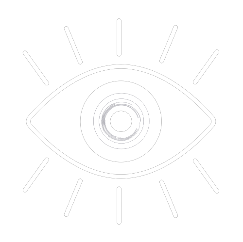

# HACKHIVE
# 
 Drishti - VoCo

<h2 align="center">
"Enabling Vocational Training and Educational Support for the Visually Impaired Through an Interactive Mobile Application"📱</h2>
<h2>Description </h2>
 <h2>Problem Statement 👾</h2>
 AI-Powered Accessibility Solutions for Blind Students in Remote Education
 

<h2> Solution 💡 </h2>
Our mission is to educate, empower, and strengthen the communication skills of visually impaired individuals, ultimately assisting them in securing employment. Our goal is to reach out to visually impaired individuals through innovative technology, providing them with a platform to learn, enhance their communication abilities, and access job opportunities. With this vision in mind, we have created an app designed specifically to cater to the needs of the blind community, offering a comprehensive solution for education, skill development, and career advancement.

### Vision 🎯:
1. Train the user to improve their linguistic skills or learn new language.

2. The app will also provide study material and courses in audio format to be accessed easily.

3. Regular tests for our users to understand their improvement.

4. A proper feedback system for us to understand whether the user liked our course content or not.

5. Interactive chat bot feature in case the user wants someone to talk with when no one is around.

6. A feature to connect all the users together at real-time and they can have a conversation among themselves. This will improve their communication skills and can provide them recreational time with some new friends.

7. An option to even connect with a VoCo Expert to clear course related doubts and any queries they might have.

8. Fun and interactive games section to improve their mental ability and train their mind.

9. To improve the UI for more easy usability for the visually impaired people.

### Implementation :
We have implemented these features:
  1. User Login through Firebase
  2. Pronunciation Guide available with support in English language.
  3. In app navigation supported.
  4. In app voice based guide available.

### Tech Stacks Used :
⦿ <b>FrontEnd :</b> 
*  

⦿ <b>BackEnd :</b>
* 
 
 

⦿ <b>Server :</b>
* 

⦿ <b>Database :</b>
* 

## Project Created & Maintained By

## :heart: Team CodeHex
1. [Vaishnavi Gupta](https://github.com/Vaishnavi2445)
2. [Shrashti Bhumarkar](https://github.com/shrashti2004)
  
